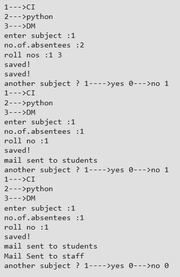

# Simple Attendance Tracker using Python

A Python-based attendance management system that updates student attendance
in an Excel file and automatically sends warning or shortage emails.

---

## Features
- Excel-based attendance storage
- Subject-wise leave tracking
- Automatic email alerts
- Warning threshold enforcement
- Staff and student notifications

---

## Subjects Used
1. Computer Intelligence (CI)
2. Python
3. Data Mining (DM)

---

## Excel Sheet Format
| Roll No | Email ID | CI | Python | DM |
|-------|----------|----|--------|----|

---

## Technologies Used
- Python 3
- openpyxl
- smtplib
- email.mime

--- 

## 🔐Gmail Configuration
- Create a separate Gmail account.
- Enable 2-Step Verification.
- Generate App Password.
- Use App Password in code.

--- 

## ⚙️ How It Works (Step-by-Step)
- Load Excel file using openpyxl.
- Take subject and absentee input.
- Increment leave count.
- Check warning threshold. (2 leaves)
- Send warning emails.
- Send shortage emails to staff.

--- 

## 📷 Screenshot

